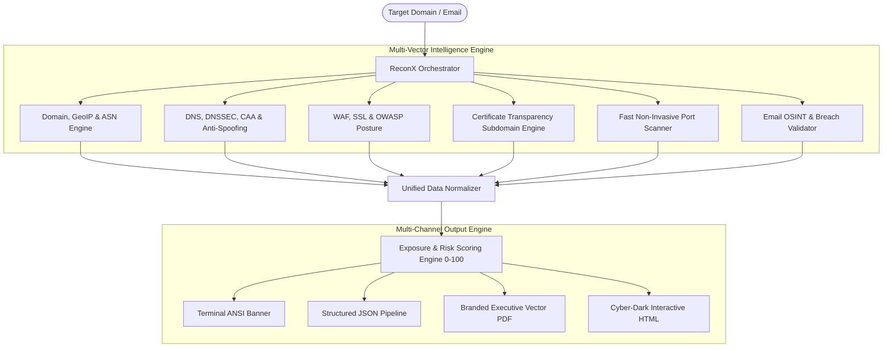

<div align="center">

```
  ____                      __   __
 |  _ \  ___  ___ ___  _ __ \ \ / /
 | |_) |/ _ \/ __/ _ \| '_ \ \ V / 
 |  _ <|  __/ (_| (_) | | | | | |  
 |_| \_\\___|\___\___/|_| |_| |_|  
```

# ReconX 🔍
### Advanced Passive Attack Surface Mapping, OSINT Intelligence & Threat Exposure Scoring

[](https://www.python.org/)
[](https://github.com/ishan-walia/ReconX-Scanner/actions)
[](https://www.docker.com/)
[](https://opensource.org/licenses/MIT)
[](https://attack.mitre.org/tactics/TA0043/)
[](https://github.com/ishan-walia/ReconX-Scanner)

<p align="center">
  <b>A production-grade, zero-intrusion attack surface mapping engine engineered for Security Operations, Penetration Testers, Bug Bounty Hunters, and DevSecOps teams.</b>
  <br />
  Aggregates public records, DNS topologies, TLS/SSL certificate transparency trees, WAF reverse proxies, service ports, and email leak intelligence into a quantified <b>Exposure Index (0–100)</b> with executive PDF and dark-themed interactive HTML reports.
</p>

[Key Features](#-key-features) •
[MITRE ATT&CK](#-mitre-attck-mapping) •
[Architecture](#-architecture) •
[Comparison](#-tool-comparison-matrix) •
[Installation & Docker](#-installation--docker) •
[Usage](#-usage--examples) •
[Reports](#-executive-reporting) •
[Future Roadmap](#-future-roadmap--next-milestones) •
[License](#-license)

---

</div>

## 🌟 Why ReconX?

Traditional vulnerability and port scanners often send thousands of aggressive packets that trigger intrusion detection systems (IDS/IPS), trip Web Application Firewalls, and saturate customer networks. 

**ReconX solves this problem** by conducting **100% non-invasive, passive reconnaissance and defensive posture auditing**:
- ⚡ **Zero Intrusion Footprint**: Audits the target perimeter using publicly available registrars, DNS-over-HTTPS, Certificate Transparency (CT) logs, and RFC-standard cryptographic handshakes without triggering SOC alerts.
- 🧱 **Automated WAF & CDN Fingerprinting**: Instantly recognizes Cloudflare, AWS CloudFront, Akamai, Fastly, Imperva/Incapsula, Sucuri, and Azure Front Door configurations.
- 🎯 **Algorithmic Exposure Metric**: Translates complex technical misconfigurations into an actionable **0–100 Risk Score** (Low, Medium, High).
- 📑 **Dual C-Suite & Technical Reporting**: Auto-compiles findings into corporate-branded vector PDFs and standalone cyber-dark interactive HTML dashboards.
- 🛡️ **DevSecOps Ready**: Easily integrates into CI/CD security quality gates via structured JSON outputs.

---

## 🚀 Key Features

### 1. 🌐 Infrastructure, IP & Geolocation Intelligence
- **Dual-Stack Resolution**: Resolves primary IPv4 and IPv6 endpoints with fallbacks.
- **Geographical & ISP Mapping**: Maps physical hosting location (City, Country), ISP organization, and Autonomous System Number (ASN).
- **Domain Parking Detection**: Identifies parking signatures and monetized nameserver infrastructure.

### 2. 🛡️ Reverse Proxy & WAF Fingerprinting
- **Edge Layer Identification**: Actively detects underlying Web Application Firewalls (WAF) and Content Delivery Networks (CDN):
  - Cloudflare, AWS CloudFront / AWS WAF, Akamai Edge, Fastly, Imperva / Incapsula, Sucuri CloudProxy, Azure Front Door, F5 BIG-IP.
- **RFC 9116 `security.txt` Discovery**: Probes `/.well-known/security.txt` to find vulnerability disclosure policies and contact vectors.

### 3. 🔐 Advanced DNS Security & Anti-Spoofing Audit
- **Deep DNS Record Querying**: High-speed resolution of `A`, `AAAA`, `MX`, `NS`, `TXT`, and `SOA` records via Cloudflare DNS-over-HTTPS (DoH).
- **Email Anti-Spoofing Evaluation**:
  - **SPF Validation** (`v=spf1`): Verifies sender authentication syntax.
  - **DMARC Enforcement** (`_dmarc.domain`): Assesses email spoofing mitigation policies (`p=reject`, `p=quarantine`, or `p=none`).
- **DNSSEC Validation**: Checks cryptographic Delegation Signer (`DS`) records to prevent DNS cache poisoning.
- **CAA Policy Audit**: Audits Certification Authority Authorization (`CAA`) records to ensure restricted certificate issuance.

### 4. 🔒 Cryptographic Posture & SSL/TLS Analysis
- **Live TLS Handshake Inspection**: Retrieves certificate subject, trusted CA issuer, protocol version, and expiration countdown.
- **CT Log Fallback**: Gracefully queries Certificate Transparency registers if direct TLS handshakes are firewalled or blocked.
- **OWASP Defensive Headers Benchmark**:
  - `Strict-Transport-Security` (HSTS)
  - `Content-Security-Policy` (CSP)
  - `X-Frame-Options` (Clickjacking defense)
  - `X-Content-Type-Options` (MIME sniffing defense)
  - `Referrer-Policy` & `Permissions-Policy`
- **Server Identity Leaks**: Flags technology disclosure headers (`Server`, `X-Powered-By`).

### 5. 🔍 Passive Subdomain Enumeration
- **Certificate Transparency Harvesting**: Extracts historical and live subdomains from `crt.sh` and `Certspotter`.
- **Threaded Concurrent DNS Probing**: Rapidly validates active endpoints (`www`, `api`, `mail`, `dev`, `stage`, `admin`, etc.).

### 6. ⚡ Rapid Service Port Auditing
- Non-invasive, multi-threaded probe across standard critical service ports:
  - **Web**: `80` (HTTP), `443` (HTTPS), `8080`, `8443`
  - **Administration**: `22` (SSH), `21` (FTP), `2082/2083/2086/2087` (cPanel/WHM)
  - **Mail Services**: `25` (SMTP), `465` (SMTPS), `587` (Submission), `110/995` (POP3), `143/993` (IMAP)
  - **Database & Services**: `3306` (MySQL), `53` (DNS)

### 7. 📧 Privacy-Preserving Email OSINT & Data Breach Intel
- **RFC Syntax & Domain MX Verification**: Confirms active receiving mail exchangers.
- **k-Anonymity Leak Lookups**: Leverages privacy-preserving SHA-1 hash ranges to audit credential leaks without exposing plaintext email addresses.

### 8. 🎯 theHarvester OSINT Engine (Passive Identity & Host Harvesting)
- **Automated Public Email Discovery**: Passively aggregates public email addresses belonging to `@target.com` from web endpoints, CT certificate trees, and RDAP records.
- **Identity & Registry Contact Correlation**: Harvests administrative and abuse points of contact from registries without loud active network scans.
- **Host-to-IP Correlation**: Automatically resolves discovered subdomains and associates them with live IP routing.

### 9. 📊 Exposure Scoring & Remediation Matrix
- Quantifies security findings into an automated **0–100 Exposure Index**:
  - `0 – 30` : 🟢 **LOW RISK** (Hardened perimeter posture)
  - `31 – 60` : 🟡 **MEDIUM RISK** (Hygiene improvements recommended)
  - `61 – 100`: 🔴 **HIGH RISK** (Immediate remediation required)
- Generates targeted, prioritized remediation advice tailored to each detected vulnerability.

---

## 🎯 MITRE ATT&CK® Mapping

ReconX directly aligns with the **MITRE ATT&CK Enterprise Reconnaissance Matrix (TA0043)**:

| Technique ID | Technique Name | ReconX Implementation |
| :--- | :--- | :--- |
| **T1596.001** | DNS Records | Automated enumeration of A, MX, NS, TXT, SPF, DMARC, CAA, and DNSSEC records via DoH |
| **T1596.002** | WHOIS & RDAP | Authoritative registry queries for registrar details, creation timestamp, and domain age |
| **T1596.003** | Digital Certificates | Certificate Transparency (CT) log aggregation, SAN harvesting, and TLS validity auditing |
| **T1590.001** | Domain Properties | Subdomain enumeration, apex domain normalization, and parking server detection |
| **T1590.002** | Network Topology | IP Geolocation, ASN mapping, ISP profiling, and reverse-proxy WAF fingerprinting |
| **T1592.002** | Software Banners | Extraction of web server disclosures (`Server`, `X-Powered-By`) and OWASP defensive posture |
| **T1589.002** | Email Addresses | Email format validation, active MX verification, and k-Anonymity breach intelligence |

---

## ⚖️ Tool Comparison Matrix

| Feature | **ReconX** | Nmap | Amass | theHarvester | Nikto |
| :--- | :---: | :---: | :---: | :---: | :---: |
| **Passive & Non-Intrusive** | ✅ Yes | ❌ No | ⚠️ Partial | ✅ Yes | ❌ No |
| **Executive Branded PDF Report** | ✅ Yes | ❌ No | ❌ No | ❌ No | ❌ No |
| **Interactive Dark HTML Report** | ✅ Yes | ❌ No | ❌ No | ❌ No | ⚠️ Basic |
| **Algorithmic Exposure Score (0-100)** | ✅ Yes | ❌ No | ❌ No | ❌ No | ❌ No |
| **WAF / CDN Fingerprinting** | ✅ Yes | ⚠️ Script | ❌ No | ❌ No | ⚠️ Basic |
| **DNSSEC & CAA Record Auditing** | ✅ Yes | ❌ No | ❌ No | ❌ No | ❌ No |
| **RFC 9116 security.txt Discovery** | ✅ Yes | ❌ No | ❌ No | ❌ No | ❌ No |
| **Email Breach Audit (k-Anonymity)** | ✅ Yes | ❌ No | ❌ No | ⚠️ Basic | ❌ No |
| **Zero External Tool Dependencies** | ✅ Yes | ❌ Binary | ❌ Go binary | ❌ API keys req | ❌ Perl |

---

## 🏗️ Architecture



---

## 📦 Installation & Docker

### Option A: Standard Python Installation

#### Prerequisites
- Python **3.8+**
- Git

```bash
# 1. Clone the repository
git clone https://github.com/ishan-walia/ReconX-Scanner.git
cd ReconX-Scanner

# 2. Set up virtual environment
# Linux / macOS:
python3 -m venv venv && source venv/bin/activate
# Windows:
python -m venv venv && .\venv\Scripts\activate

# 3. Install dependencies
pip install -r requirements.txt
```

---

### Option B: Docker Container (Recommended for Zero Setup)

Run ReconX anywhere without installing local dependencies:

```bash
# Build the Docker image
docker build -t reconx .

# Run a scan and save PDF/HTML reports into local ./reports directory
docker run --rm -v $(pwd)/reports:/app/reports reconx -t example.com --pdf --html
```

Or run via **Docker Compose**:
```bash
docker compose up
```

---

## 💻 Usage & Examples

### 1. Interactive Mode
Run without arguments for the interactive guided wizard:
```bash
python reconx.py
```

```text
Enter Target:
https://example.com

Enter Email:
admin@example.com

[*] Initiating ReconX Advanced Scan on: example.com
    -> Resolving IP Geolocation, ASN & ISP...
    -> Auditing DNS, SPF, DMARC, DNSSEC & CAA records...
    -> Querying RDAP Registrar & WHOIS data...
    -> Scanning common service ports...
    -> Probing Website, WAF, SSL & CT logs...
    -> Discovering public subdomains...
```

---

### 2. Command-Line Interface (CLI)

#### Standard Domain Scan
```bash
python reconx.py -t example.com
```

#### Full Domain & Email Exposure Audit
```bash
python reconx.py -t example.com -e security@example.com
```

#### Export Branded PDF & Interactive HTML Reports
```bash
python reconx.py -t example.com --pdf --html --company "DEFENSE LABS GLOBAL"
```

#### Machine-Readable JSON for Pipelines & SIEM
```bash
python reconx.py -t example.com --json > recon_results.json
```

#### CI/CD Pipeline Quality Gate Example
Fail the build if the target exposure score exceeds threshold:
```bash
python reconx.py -t staging.company.com --json | jq -e '.exposure.score <= 40'
```

---

## 📋 CLI Options Reference

| Option | Short | Type | Description |
| :--- | :---: | :---: | :--- |
| `--target` | `-t` | String | Target domain or URL (e.g. `example.com` or `https://target.io`) |
| `--email` | `-e` | String | Target email to audit for formatting, MX validity, and breach exposure |
| `--harvest` | | Flag | Enable aggressive theHarvester OSINT email and host harvesting |
| `--pdf` | | Path / Flag | Export executive PDF audit report (default: `reports/reconx_<target>_<time>.pdf`) |
| `--html` | | Path / Flag | Export cyber-dark interactive HTML report (default: `reports/reconx_<target>_<time>.html`) |
| `--company` | | String | Company/Organization branding name for report headers |
| `--json` | | Flag | Output results as structured JSON (for SIEM, CI/CD, and pipelines) |
| `--no-color`| | Flag | Disable ANSI color codes in console output |
| `--help` | `-h` | Flag | Show full help and usage manual |

---

## 📄 Executive Reporting

ReconX generates two report formats:

1. **Branded Vector PDF Report (`--pdf`)**:
   - Customizable corporate header banner with confidentiality markings.
   - Prominent Risk Score Callout (0-100) with color-coded risk badge.
   - Clean tables for Infrastructure, DNSSEC, Anti-Spoofing, SSL/TLS, and Open Ports.
   - Numbered, actionable remediation steps.

2. **Cyber-Dark Interactive HTML Report (`--html`)**:
   - Modern glassmorphism dark-theme layout with responsive grid.
   - Visual gauge for the 0-100 Exposure Index.
   - Comprehensive OWASP security headers comparison matrix.
   - Discovered subdomain grid and security findings alerts.
   - Self-contained single file with zero external runtime dependencies.

---

## 🚀 Future Roadmap & Next Milestones

What's coming next in ReconX? Here is the strategic product roadmap:

### 📍 Phase 1: Threat Intelligence & Passive Feeds (v2.0)
- [ ] **Shodan & Censys Passive API Integration**: Ingest indexed banners, past CVEs, and historical exposed services without sending active probe packets.
- [ ] **VirusTotal / AlienVault OTX IP Reputation**: Query threat intelligence feeds to check if the target IP is flagged in botnets, malware distribution, or phishing.
- [ ] **HaveIBeenPwned Enterprise v3 Integration**: Automated breach metadata retrieval (leak names, compromised data classes).

### 📍 Phase 2: Active Vulnerability & Misconfiguration Auditing (v2.2)
- [ ] **Subdomain Takeover Detector**: Fingerprint dangling CNAME pointers to identify unclaimed cloud resources (AWS S3, GitHub Pages, Heroku, Azure WebApps).
- [ ] **DNS Zone Transfer (AXFR) Audit**: Attempt non-destructive DNS zone transfers against authoritative nameservers to identify exposed zone files.
- [ ] **CORS Misconfiguration Auditor**: Passive inspection of `Access-Control-Allow-Origin: *` and credential reflections.

### 📍 Phase 3: DevSecOps Automation & Continuous Monitoring (v2.5)
- [ ] **Webhook Alert Dispatcher**: Send instant scan summaries and PDF reports directly to **Slack**, **Microsoft Teams**, or **Discord**.
- [ ] **Scheduled Continuous Monitor & Asset Diffing**: Cron daemon that re-scans assets periodically and triggers alerts when a new subdomain or port appears.
- [ ] **Pre-Commit / GitHub Action Gate**: Official ReconX GitHub Action with configurable risk thresholds (`fail-on-risk-score > 50`).

### 📍 Phase 4: Attack Surface Graph & Web Dashboard (v3.0)
- [ ] **Interactive Attack Surface Graph**: Force-directed network graph (D3.js / Cytoscape) visually mapping: Target Apex ➔ Subdomains ➔ IP Addresses ➔ Open Ports ➔ WAF ➔ Vulnerabilities.
- [ ] **FastAPI Backend & Next.js Web UI**: Full-fledged self-hosted web console with scan history, target management, and multi-user access.
- [ ] **AI-Assisted Remediation Playbooks**: Context-aware remediation code snippets (Apache, Nginx, Cloudflare, Caddy) for every identified gap.

---

## 🧪 Running Unit Tests

ReconX includes a 100% passing test suite validating normalization, scoring, WAF identification, and report renderers:

```bash
python -m unittest discover -s tests -p "test_*.py" -v
```

---

## 📂 Project Structure

```
reconx/
├── .github/
│   └── workflows/
│       └── ci.yml             # GitHub Actions automated multi-version CI/CD
├── reconx/
│   ├── __init__.py            # Package initialization
│   ├── core.py                # Central scanner coordinator & pipeline
│   ├── domain_recon.py        # IP, DNS records, DNSSEC, CAA, RDAP & WHOIS
│   ├── website_recon.py       # WAF/CDN detection, SSL/TLS, security.txt, OWASP headers
│   ├── subdomain_recon.py     # Certificate Transparency (crt.sh) discovery
│   ├── port_scanner.py        # Concurrent TCP port & service auditing
│   ├── email_recon.py         # Email syntax, MX validation & breach lookup
│   ├── scoring.py             # Exposure scoring engine (0-100) & advice
│   ├── pdf_generator.py       # Corporate branded vector PDF report generator
│   ├── html_generator.py      # Cyber-dark responsive interactive HTML report generator
│   └── reporter.py            # Terminal ANSI banner & JSON renderers
├── reports/                   # Default output directory for generated audits
├── tests/
│   └── test_reconx.py         # Unit test suite covering all modules
├── Dockerfile                 # Multi-stage hardened Docker container definition
├── docker-compose.yml         # Container compose configuration
├── reconx.py                  # Main executable CLI & interactive entry point
├── requirements.txt           # Production dependencies
├── .gitignore                 # Environment, cache & report ignores
└── README.md                  # Comprehensive documentation & roadmap
```

---

## ⚖️ Legal & Ethical Disclaimer

> [!WARNING]
> **ReconX is developed strictly for authorized security assessments, defensive posture hardening, educational research, and authorized penetration testing.**
> Users are solely responsible for ensuring compliance with applicable local, state, and international cyber laws. Performing scans against targets without prior authorization is strictly prohibited. The developer assumes no liability for any misuse, unauthorized access, or consequences resulting from this tool.

---

## 🤝 Contributing

Contributions from the cybersecurity and open-source communities are warmly welcomed!
1. Fork the Repository (`https://github.com/ishan-walia/ReconX-Scanner`)
2. Create your Feature Branch (`git checkout -b feature/EpicNewFeature`)
3. Commit your Changes (`git commit -m 'feat: Add EpicNewFeature'`)
4. Push to the Branch (`git push origin feature/EpicNewFeature`)
5. Open a Pull Request

---

## 📜 License

Distributed under the **MIT License**. See `LICENSE` for more information.

<div align="center">
  <sub>Engineered by <b>Ishan Walia</b> • Powered by Open-Source Cyber Threat Intelligence</sub>
</div>
