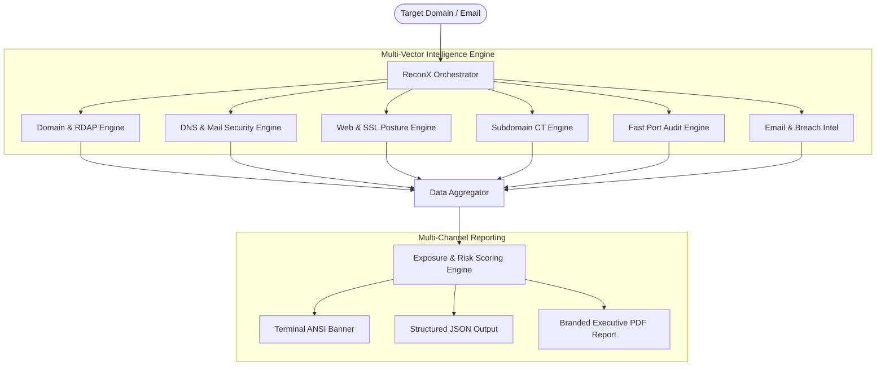

<div align="center">

```
  ____                      __   __
 |  _ \  ___  ___ ___  _ __ \ \ / /
 | |_) |/ _ \/ __/ _ \| '_ \ \ V / 
 |  _ <|  __/ (_| (_) | | | | | |  
 |_| \_\\___|\___\___/|_| |_| |_|  
```

# ReconX 🔍
### Next-Gen Passive OSINT, Attack Surface Mapping & Threat Exposure Assessment

[](https://www.python.org/)
[](https://opensource.org/licenses/MIT)
[](https://github.com/ishan-walia/ReconX-Scanner)
[](https://github.com/ishan-walia/ReconX-Scanner)
[](https://github.com/ishan-walia/ReconX-Scanner/pulls)

<p align="center">
  <b>An automated, non-invasive attack surface intelligence suite built for security analysts, penetration testers, and DevSecOps teams.</b>
  <br />
  Aggregates public domain records, SSL postures, DNS configurations, exposed service ports, and email leak intelligence into a quantified <b>Exposure Score (0–100)</b> with executive-ready PDF reporting.
</p>

[Key Features](#-key-features) •
[Architecture](#-architecture) •
[Installation](#-installation) •
[Quick Start](#-usage--examples) •
[Executive Reports](#-executive-pdf-reporting) •
[Scoring Methodology](#-exposure-scoring-methodology) •
[License](#-license)

---

</div>

## 🌟 Why ReconX?

Traditional network scanners and port scanners trigger firewall alerts, IDS/IPS alarms, and rate-limits. **ReconX** focuses on **passive reconnaissance and non-destructive validation**, aggregating threat exposure data from publicly available registers, Certificate Transparency (CT) logs, RFC-compliant mail records, and secure cryptographic handshakes.

- ⚡ **Zero Intrusion Risk**: Conduct deep surface assessments without sending payload exploits or triggering SOC alarms.
- 🎯 **Algorithmic Exposure Metric**: Translates complex technical misconfigurations into an actionable **0–100 Risk Score** (Low, Medium, High).
- 📑 **C-Suite Ready Reports**: Auto-compiles findings into professional, customizable vector PDF audit documents with corporate branding.
- 🧩 **Multi-Vector Auditing**: Evaluates DNS, WHOIS, SSL/TLS, OWASP Security Headers, Subdomains, Ports, and Email Leak Footprints in seconds.

---

## 🚀 Key Features

### 1. 🌐 Domain, Geolocation & DNS Reconnaissance
- **IP & Geolocation Intel**: Resolves IPv4/IPv6 addresses with ISP, ASN, country, and organization mapping.
- **DNS Record Profiling**: Deep enumeration of `A`, `AAAA`, `MX`, `NS`, `TXT`, and `SOA` records.
- **Email Security Auditing**: Verifies **SPF** (`v=spf1`) and **DMARC** (`_dmarc.domain`) alignment to detect spoofing and phishing vulnerabilities.
- **RDAP / WHOIS Profiling**: Queries authoritative registry services for registrar details, creation timestamp, and domain age.

### 2. 🛡️ Web Security & Cryptographic Posture
- **SSL/TLS Certificate Inspection**: Evaluates issuer validity, expiration countdown, protocol version, and SAN entries.
- **HTTP Enforcement**: Detects unencrypted transport, verifies HTTP-to-HTTPS redirect chains.
- **OWASP Header Analysis**: Benchmarks against industry-standard defensive headers:
  - `Strict-Transport-Security` (HSTS)
  - `Content-Security-Policy` (CSP)
  - `X-Frame-Options` (Clickjacking defense)
  - `X-Content-Type-Options` (MIME sniffing defense)
  - `Referrer-Policy` & `Permissions-Policy`
- **Server Identity Leaks**: Flags technology disclosure headers (`Server`, `X-Powered-By`).
- **Sensitive Endpoint Discovery**: Probes for exposed `robots.txt` and `sitemap.xml`.

### 3. 🔍 Passive Subdomain Enumeration
- **Certificate Transparency (crt.sh)**: Harvests historical and hidden subdomains from public certificate logs.
- **Concurrent DNS Validation**: Rapidly probes and confirms live subdomains (`www`, `api`, `mail`, `dev`, `stage`, etc.) using high-throughput thread pools.

### 4. ⚡ Concurrent Port & Service Auditing
- Non-invasive, rapid multi-threaded inspection of common critical ports:
  - Web & Proxies: `80`, `443`, `8080`, `8443`
  - Administration & Remote Access: `22` (SSH), `21` (FTP), `2082/2083/2086/2087` (cPanel/WHM)
  - Mail Services: `25` (SMTP), `465` (SMTPS), `587` (Submission), `110/995` (POP3), `143/993` (IMAP)
  - Databases: `3306` (MySQL), `53` (DNS)

### 5. 📧 Email OSINT & Data Breach Intelligence
- **RFC Syntax & Format Verification**: Validates structure and domain routing.
- **MX Route Verification**: Tests if target domain has active, receiving mail exchangers.
- **Breach Exposure Check**: Leverages privacy-preserving **k-Anonymity SHA-1 hash ranges** to audit compromised credential leaks without exposing the plain email.

### 6. 📊 Automated Scoring & Mitigation Engine
- Calculates a weighted **Security Exposure Index (0–100)**:
  - `0 – 30` : 🟢 **LOW RISK** (Hardened surface posture)
  - `31 – 60` : 🟡 **MEDIUM RISK** (Hygiene improvements recommended)
  - `61 – 100`: 🔴 **HIGH RISK** (Immediate remediation required)
- Produces targeted, prioritized remediation advice tailored to each detected gap.

---

## 🏗️ Architecture



---

## 📦 Installation

### Prerequisites
- Python **3.8+**
- Git

### 1. Clone the Repository
```bash
git clone https://github.com/ishan-walia/ReconX-Scanner.git
cd ReconX-Scanner
```

### 2. Set Up a Virtual Environment (Recommended)
```bash
# Linux / macOS
python3 -m venv venv
source venv/bin/activate

# Windows (Command Prompt / PowerShell)
python -m venv venv
.\venv\Scripts\activate
```

### 3. Install Dependencies
```bash
pip install -r requirements.txt
```

---

## 💻 Usage & Examples

ReconX supports both an intuitive **Interactive Wizard** and a flexible **CLI Mode** suitable for automated scripting, CI/CD, and red/blue team workflows.

### 1. Interactive Mode
Run the tool without arguments. ReconX will prompt for your target domain, email, and whether you'd like a branded PDF generated:
```bash
python reconx.py
```

```text
Enter Target:
https://example.com

Enter Email:
admin@example.com

[*] Initiating ReconX Advanced Scan on: example.com
    -> Resolving IP Geolocation, ASN & ISP...
    -> Auditing DNS, SPF, DMARC & MX records...
    -> Querying RDAP Registrar & WHOIS data...
    -> Scanning common service ports...
    -> Probing Website, SSL & Certificate Transparency logs...
    -> Discovering public subdomains...
```

---

### 2. Command-Line Interface (CLI)

#### Standard Domain Scan
```bash
python reconx.py -t example.com
```

#### Full Domain & Email Exposure Audit
```bash
python reconx.py -t example.com -e security@example.com
```

#### Generate Timestamped PDF Report in `reports/`
```bash
python reconx.py -t example.com --pdf
```

#### Export PDF with Custom Corporate Branding
```bash
python reconx.py -t example.com -e admin@example.com --pdf reports/company_audit.pdf --company "CYBER DEFENSE INTELLIGENCE LABS"
```

#### Machine-Readable JSON for Pipelines
```bash
python reconx.py -t example.com --json > recon_results.json
```

#### Clean Plaintext Output (No Colors)
```bash
python reconx.py -t example.com --no-color
```

---

## 📋 CLI Options Reference

| Option | Short | Type | Description |
| :--- | :---: | :---: | :--- |
| `--target` | `-t` | String | Target domain or URL (e.g. `example.com`, `https://target.io`) |
| `--email` | `-e` | String | Target email address to audit for format, MX and breach exposure |
| `--pdf` | | String/Flag | Generate an executive PDF audit report (optional path) |
| `--company` | | String | Company/Organization name for the PDF report header banner |
| `--json` | | Flag | Output results as structured JSON (ideal for SIEM & automated tooling) |
| `--no-color`| | Flag | Disable ANSI colors in terminal output |
| `--help` | `-h` | Flag | Display CLI argument help manual |

---

## 🖥️ Terminal Output Preview

```text
============================================================
                     RECONX AUDIT REPORT
============================================================
TARGET       : example.com
SCAN TIME    : 2026-09-13 12:00:00 UTC
RISK RATING  : LOW (24/100)
------------------------------------------------------------

[+] DOMAIN & NETWORK INTELLIGENCE
  • Primary IP        : 93.184.216.34
  • Hostname / RDAP   : RESERVED-10, US
  • HTTPS Enforcement : Enabled (Enforces secure transport)
  • SSL Certificate   : Valid (DigiCert Inc, 184 days remaining)
  • Server Header     : ECS (Technology disclosed)

[+] DNS & EMAIL AUTHENTICATION
  • A Record          : 93.184.216.34
  • MX Record         : mx.example.com [Priority 10]
  • SPF Status        : Configured (v=spf1 -all)
  • DMARC Status      : Configured (p=reject)

[+] IDENTIFIED SUBDOMAINS (via Certificate Transparency)
  • www.example.com
  • mail.example.com
  • dev.example.com

[+] OPEN SERVICE PORTS
  • Port 80/tcp   : HTTP
  • Port 443/tcp  : HTTPS

[+] SECURITY HEADERS AUDIT (Score: 6/7)
  [✓] Strict-Transport-Security
  [✓] Content-Security-Policy
  [✓] X-Frame-Options
  [✓] X-Content-Type-Options
  [✓] Referrer-Policy
  [✓] Permissions-Policy

============================================================
EXPOSURE SCORE : 24/100
EXPOSURE LEVEL : LOW 🟢
============================================================
```

---

## 📄 Executive PDF Reporting

ReconX features a built-in vector PDF reporting engine:
- **Corporate Branding**: Configurable top organization title banner.
- **Executive Summary Box**: Visual risk metric callout with date, target, and status badge.
- **Categorized Finding Tables**: Formatted breakdowns of DNS, SSL, Web, Ports, and Email exposures.
- **Actionable Remediation Matrix**: Step-by-step mitigation recommendations for administrators.

*Reports are automatically saved to the `reports/` directory with clean ISO-compliant timestamps.*

---

## 📐 Exposure Scoring Methodology

ReconX computes the **Security Exposure Index (0–100)** through a weighted penalty formula based on real-world exploitability:

| Vector | Condition | Exposure Penalty |
| :--- | :--- | :---: |
| **Transport Security** | No HTTPS redirect / Plain HTTP accessible | `+25` |
| **SSL/TLS Validation** | Expired or missing SSL certificate | `+20` |
| **Email Defense** | Missing or misconfigured DMARC record | `+15` |
| **Email Defense** | Missing SPF record | `+10` |
| **OWASP Headers** | Missing critical defensive headers | `+3` each |
| **Information Leak** | Verbose `Server` / `X-Powered-By` banner | `+5` |
| **Credential Intel** | Email identified in public breach index | `+20` |
| **Attack Surface** | High-risk administrative ports exposed | `+10` each |

---

## 🧪 Running Unit Tests

ReconX comes with a test suite verifying scanner modules, scoring math, and input sanitization:

```bash
# Run all unit tests
python -m unittest discover -s tests -p "test_*.py" -v
```

---

## 📂 Project Structure

```
reconx/
├── reconx/
│   ├── __init__.py          # Package initialization
│   ├── core.py              # Central scanner coordinator & pipeline
│   ├── domain_recon.py      # IP, DNS records (A/MX/TXT), RDAP & WHOIS
│   ├── website_recon.py     # SSL/TLS, HTTPS redirect, OWASP headers
│   ├── subdomain_recon.py   # Certificate Transparency (crt.sh) discovery
│   ├── port_scanner.py      # Concurrent TCP port & service auditing
│   ├── email_recon.py       # Email syntax, MX validation & breach lookup
│   ├── scoring.py           # Exposure scoring engine (0-100) & advice
│   ├── pdf_generator.py     # Corporate branded PDF report generator
│   └── reporter.py          # Terminal ANSI banner & JSON renderers
├── reports/                 # Default directory for generated PDF audits
├── tests/
│   └── test_reconx.py       # Comprehensive unit test suite
├── reconx.py                # Main executable CLI & interactive entry point
├── requirements.txt         # Production dependencies
├── .gitignore               # Environment & cache ignores
└── README.md                # Documentation & usage manual
```

---

## ⚖️ Legal & Ethical Disclaimer

> [!WARNING]
> **ReconX is developed exclusively for authorized security auditing, educational research, defensive hardening, and authorized penetration testing.**
> Users are strictly responsible for adhering to applicable local and international laws. Performing network audits against targets without prior authorization is strictly prohibited. The author assumes no liability for any misuse or damage caused by this software.

---

## 🤝 Contributing

Contributions are welcome! If you'd like to contribute:
1. Fork the Project (`https://github.com/ishan-walia/ReconX-Scanner`)
2. Create your Feature Branch (`git checkout -b feature/AmazingFeature`)
3. Commit your Changes (`git commit -m 'feat: Add AmazingFeature'`)
4. Push to the Branch (`git push origin feature/AmazingFeature`)
5. Open a Pull Request

---

## 📜 License

Distributed under the **MIT License**. See `LICENSE` for more information.

<div align="center">
  <sub>Developed by <b>Ishan Walia</b> • Powered by Open-Source Cyber Intelligence</sub>
</div>
